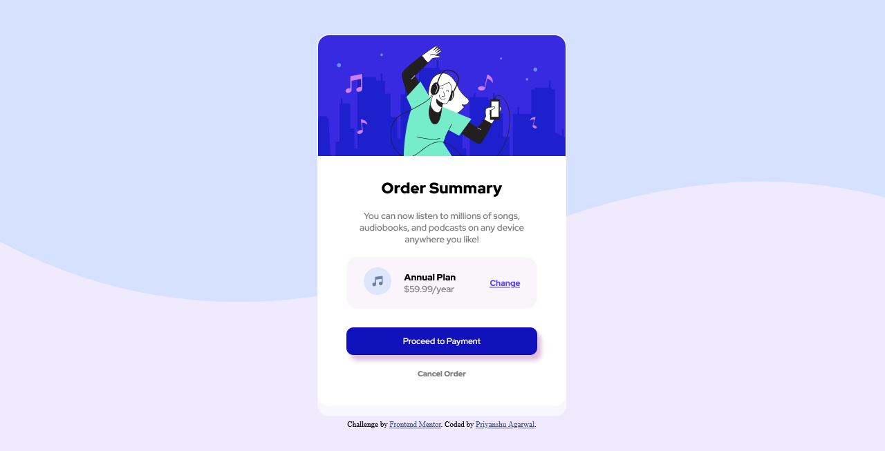
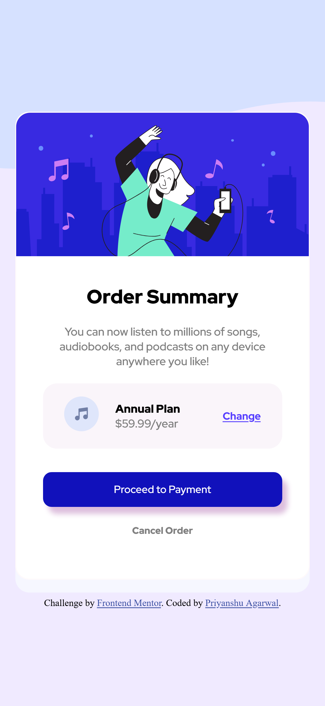

# Frontend Mentor - Order summary card solution

This is a solution to the [Order summary card challenge on Frontend Mentor](https://www.frontendmentor.io/challenges/order-summary-component-QlPmajDUj). Frontend Mentor challenges help you improve your coding skills by building realistic projects.
## Table of contents

- [Overview](#overview)
  - [The challenge](#the-challenge)
  - [Screenshot](#screenshot)
  - [Links](#links)
- [My process](#my-process)
  - [Built with](#built-with)
  - [What I learned](#what-i-learned)
  - [Continued development](#continued-development)
- [Author](#author)

## overview
### The challenge

Users should be able to:

- View the optimal layout depending on their device's screen size
- See hover and focus states for interactive elements

### Screenshot

### Links

- Live Site URL: [Frontend Mentor - Order summary card solution](https://order-summary-card4206.netlify.app/)

### Built with

- Semantic HTML5 markup
- CSS custom properties
- Flexbox

### What I learned

Working with this project made me realize what's the true meaning of learning by working.
While working on this project I learned concepts like :-

- dividing and conquer technique
- Flexbox properties 
- Resposive Design of Website 
- positioning of div to the centre of the screen
- Working with pattern design  was new to me this time

### Continued development

- During this project I learned a lot about responsive designs and hope to refine that in my upcoming projects.
- While working with images properties and adjusting the width and height properties of it for being resposive is one part of skill I really need to work upon.
- This time the tough part was to work upone the responsive design and it really requires good understanding of concepts.So thats what my focus will be.

## Author

- Website - [Frontend Mentor - Order summary card solution](https://order-summary-card4206.netlify.app/)
- Frontend Mentor - [@Priyanshu4206](https://www.frontendmentor.io/profile/Priyanshu4206)
